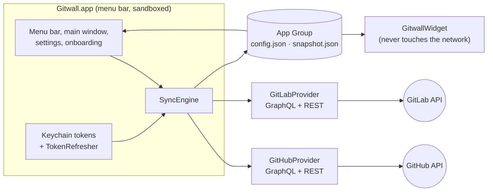

<p align="center">
  
</p>

<h1 align="center">Gitwall</h1>

<p align="center">
  Pull requests, merge requests and issues from GitHub and GitLab, in your Mac menu bar and on your desktop.
</p>

<p align="center">
  <a href="https://github.com/prokopsimek/gitwall/actions/workflows/ci.yml"></a>
  <a href="https://github.com/prokopsimek/gitwall/releases/latest"></a>
  
  
  <a href="LICENSE"></a>
</p>


Gitwall is a free, open-source macOS app for everyone who waits on code review or keeps an eye on a team's work.
It gathers open pull requests (merge requests on GitLab) and issues from the repositories you choose, sorts them
by latest activity and shows review, CI, draft and merge-conflict state at a glance. Click an item to open it in
the browser. There is no server: your Mac talks to GitHub and GitLab directly.

## Download

**[Download the latest release](https://github.com/prokopsimek/gitwall/releases/latest)**, unzip it and move
Gitwall.app to Applications. The build is signed with a Developer ID and notarized by Apple, so it opens without a
Gatekeeper warning. It does not update itself; the Mac App Store version (in review) will.

Requires macOS 14 Sonoma or later.

## Features

**Presets for every account, out of the box.** Each account you add comes with three presets: pull requests
assigned to you, issues assigned to you, and pull requests waiting for your review. Change their filters, delete
them or build your own from any mix of accounts, repositories, pull requests and issues.


**Filters that work the same on both platforms.** Relation to you (author, assignee, requested reviewer), drafts,
review state, checks, merge conflicts, labels, age, milestone and text. Each preset also decides which events
notify you.


**Issues too, not just pull requests.**


**Desktop widgets in four sizes.** Counter, List, Board and Wide Board. Add as many as you like; each widget shows
the preset you pick for it.


**Right there in your menu bar**, with the number of reviews waiting for you next to the icon.


And also:

- Sign in with GitHub or GitLab in one click, or paste a personal access token. OAuth tokens refresh in the
  background, so you sign in once.
- GitHub.com, GitHub Enterprise Server, GitLab.com and self-managed GitLab (16 or newer), several accounts at once.
- Local notifications for new items, review requests, approvals, requested changes, failed checks, merges and closes.
- A heads-up a week before a personal access token expires.
- Private by design: no analytics, no third-party services, credentials only in the macOS Keychain.
  See the [privacy policy](https://prokopsimek.github.io/gitwall/privacy/).

## Quick start

1. **Connect an account.** The first launch opens a short walkthrough. Choose *Sign in with GitHub* (you confirm a
   code at github.com) or *Sign in with GitLab*, or paste a personal access token. The account's three presets
   appear right away.
2. **Pick repositories.** Tick single repositories, or a whole GitHub organization or GitLab group so new
   repositories are picked up automatically.
3. **Add a widget.** Right-click the desktop › *Edit Widgets…* › search “Gitwall” › drag a size onto the desktop.
   Right-click the widget › *Edit “Gitwall”* › choose its preset.

### Supported hosts

| Host | Sign in | Token alternative |
|---|---|---|
| github.com | OAuth device flow, built in | Classic token with `repo` and `read:org`, or fine-grained with read access to Pull requests, Issues, Metadata |
| GitHub Enterprise Server | Your own OAuth App's client ID (Settings › Accounts › Advanced) | Same scopes as github.com |
| gitlab.com | OAuth with PKCE, built in | Personal access token with `read_api` |
| Self-managed GitLab 16+ | Your own application's client ID, redirect `gitwall://oauth/gitlab` | Personal access token with `read_api` |

## Development

You need Xcode 26 and [XcodeGen](https://github.com/yonaskolb/XcodeGen).

```sh
brew install xcodegen
git clone https://github.com/prokopsimek/gitwall.git && cd gitwall
make run          # generates the project, builds Debug and launches it
```

| Command | What it does |
|---|---|
| `make run` | Debug build and launch |
| `make test` | `swift test` for every package, then the app tests |
| `make test-packages` | Package tests only (fast, no Xcode UI) |
| `make install` | Release build into `~/Applications`, for daily use |
| `make screenshots` | App Store and README screenshots from built-in demo data |
| `make archive` / `make release` | App Store archive / notarized download (see [RELEASING](docs/RELEASING.md)) |

`project.yml` is the source of truth; the generated `Gitwall.xcodeproj` is not committed.

### How it fits together



The app fetches and writes a snapshot into the App Group; widgets only read it and apply their preset with the
same `FilterEngine` the app uses, so both always agree.

| Where | What lives there |
|---|---|
| [`Packages/`](Packages/AGENTS.md) | All logic, test-first: models, filters, sync, providers, OAuth |
| [`Gitwall/`](Gitwall/AGENTS.md) | App target: windows, menu bar, settings, onboarding |
| [`GitwallWidget/`](GitwallWidget/AGENTS.md) | The four widgets (and why their kinds must never be renamed) |
| [`Scripts/`](Scripts/AGENTS.md) | App Store Connect client, screenshot pipeline, icon rendering |
| [`docs/adr/`](docs/adr) | Why things are the way they are |

### Handy launch arguments (Debug builds)

| Argument | Use it for |
|---|---|
| `--debug-fresh` | A throwaway container and in-memory Keychain: try onboarding or sign-in without touching your real accounts |
| `--debug-demo` | Fictional accounts and items, no network; add `--debug-demo-widgets` to see all widget sizes |
| `--debug-onboarding-step <step>` | Jump straight to one walkthrough screen |
| `--debug-github-token <pat> --debug-repos a/b` | Create a GitHub account without clicking |

```sh
build/DerivedData/Build/Products/Debug/Gitwall.app/Contents/MacOS/Gitwall --debug-fresh
```

### Tests

Logic is developed test-first with Swift Testing, against fixtures captured from the real APIs. Tests that need a
live server or a human are skipped unless you opt in:

```sh
GITWALL_GITLAB_TOKEN=glpat-… GITWALL_GITLAB_URL=https://gitlab.example.com \
  swift test --package-path Packages/GitwallGitLab --filter Integration
GITWALL_OAUTH_INTERACTIVE=1 swift test --package-path Packages/GitwallAuth --filter Interactive
```

## Contributing

Issues and pull requests are welcome. A few house rules, spelled out in [AGENTS.md](AGENTS.md):

- Logic goes into a package with a test first; the app and widget targets stay thin.
- Provider-specific types never reach the UI; add a capability instead of `if kind == .github`.
- Never commit tokens or keys. OAuth client IDs in `OAuthClients.swift` are public by design.
- Commit messages follow [Conventional Commits](https://www.conventionalcommits.org).

## License

MIT, see [LICENSE](LICENSE). Made by [Prokop Simek](https://github.com/prokopsimek).
