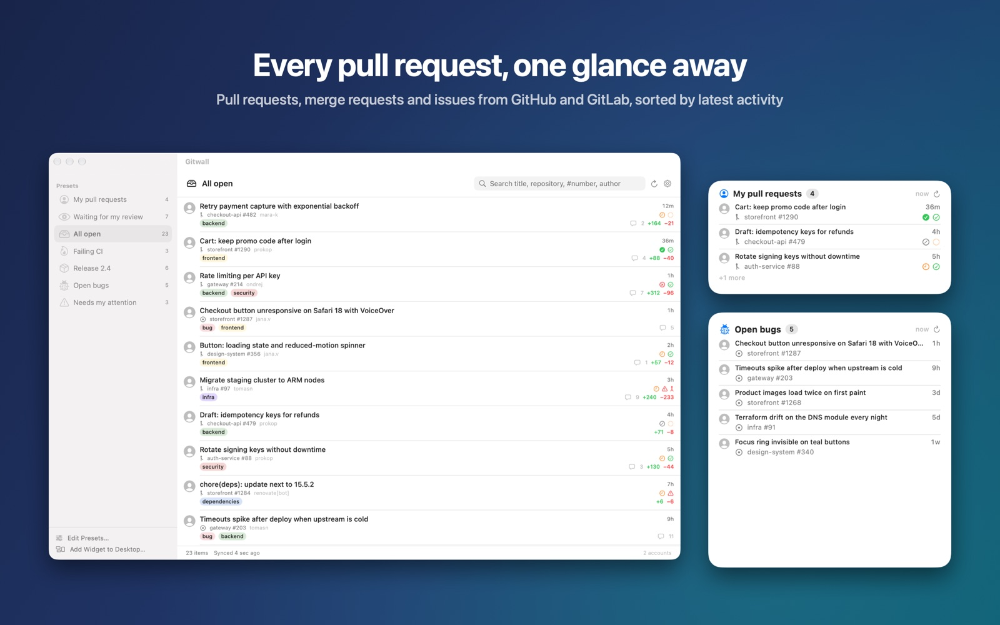
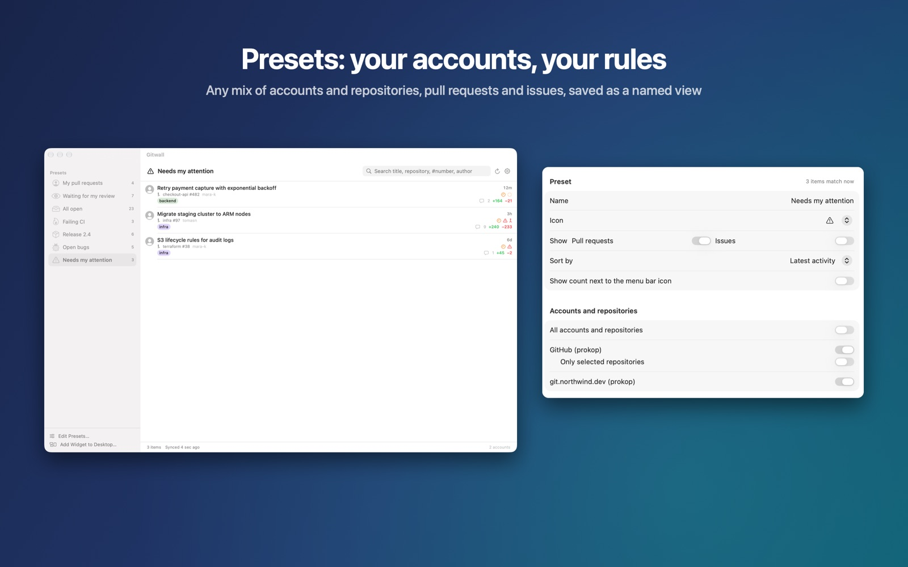
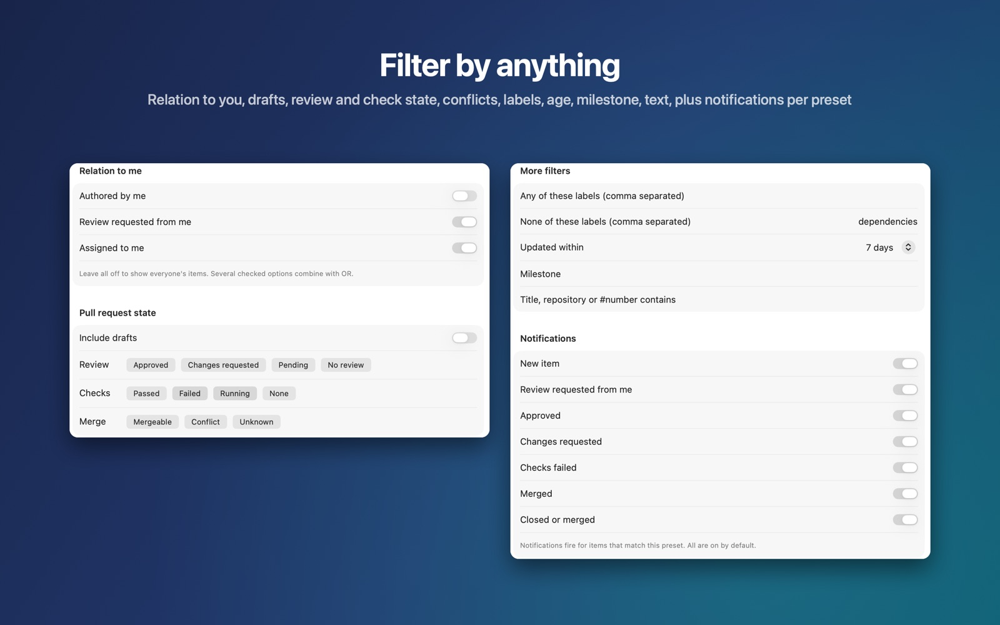
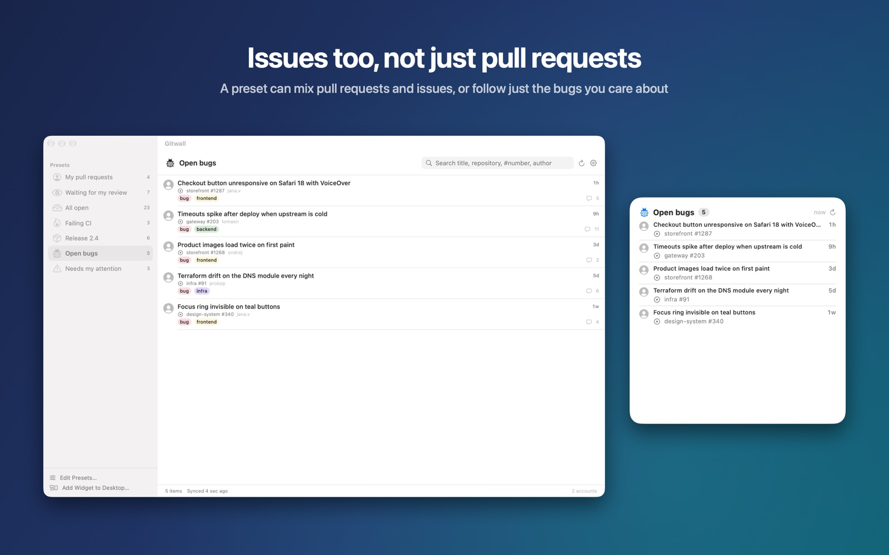
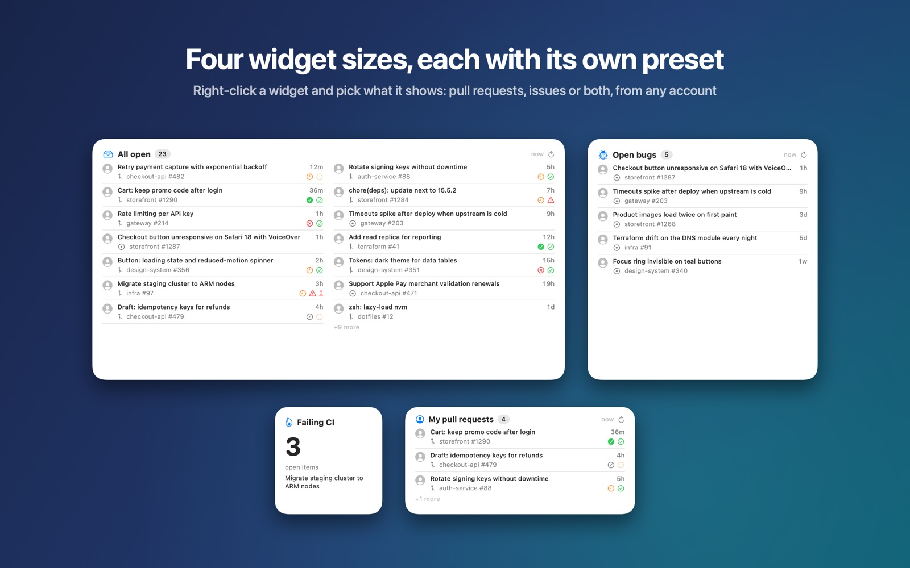
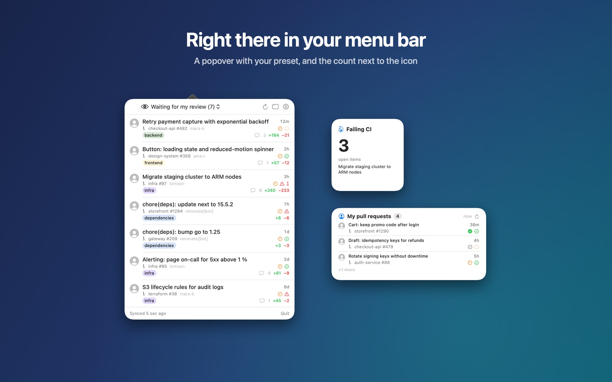
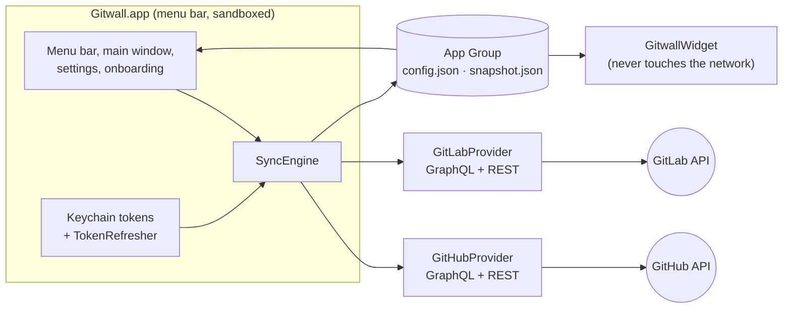

<p align="center">
  
</p>

<h1 align="center">Gitwall</h1>

<p align="center">
  Pull requests, merge requests and issues from GitHub and GitLab, in your Mac menu bar and on your desktop.
</p>

<p align="center">
  <a href="https://github.com/prokopsimek/gitwall/actions/workflows/ci.yml"></a>
  <a href="https://github.com/prokopsimek/gitwall/releases/latest"></a>
  
  
  <a href="LICENSE"></a>
</p>



Gitwall is a free, open-source macOS app for everyone who waits on code review or keeps an eye on a team's work.
It gathers open pull requests (merge requests on GitLab) and issues from the repositories you choose, sorts them
by latest activity and shows review, CI, draft and merge-conflict state at a glance. Click an item to open it in
the browser. There is no server: your Mac talks to GitHub and GitLab directly.

## Download

**[Download the latest release](https://github.com/prokopsimek/gitwall/releases/latest)**, unzip it and move
Gitwall.app to Applications. The build is signed with a Developer ID and notarized by Apple, so it opens without a
Gatekeeper warning. It does not update itself; the Mac App Store version (in review) will.

Requires macOS 14 Sonoma or later.

## Features

**Presets for every account, out of the box.** Each account you add comes with three presets: pull requests
assigned to you, issues assigned to you, and pull requests waiting for your review. Change their filters, delete
them or build your own from any mix of accounts, repositories, pull requests and issues.



**Filters that work the same on both platforms.** Relation to you (author, assignee, requested reviewer), drafts,
review state, checks, merge conflicts, labels, author logins, age, milestone and text. Each preset also decides
which events notify you.

Archived repositories never show up: nothing in them can be merged or closed, so Gitwall leaves them out of every
list and does not offer them when you pick repositories.

Pull requests that a cloud agent opened for you stay in "Waiting for my review" even though they are drafts:
Copilot and the Claude and Codex GitHub apps request the review before a person marks the pull request ready.
Filter the agents themselves with author logins such as `copilot-swe-agent` or `cursor`.



**A query field that speaks GitHub search syntax.** When the tick boxes run out, every preset has a *Query*
field. Gitwall reads it with GitHub's own rules and checks it against the items it already has, so it works for
GitLab too and the widget always agrees with the menu bar.

```
assignee:@me AND (assignee:franta-dxh OR assignee:lumir-sokol OR assignee:tom-gilsky)
```

That one means *assigned to me **and** to at least one of the three*. A space works as `AND` too, `AND` binds
tighter than `OR`, and parentheses group up to five levels deep, as on GitHub. A comma inside a qualifier is a
shorter OR, so `assignee:@me assignee:franta-dxh,lumir-sokol,tom-gilsky` says the same thing, and a leading `-`
excludes a term.

| Qualifier | Matches |
|---|---|
| `assignee:` | anyone assigned |
| `author:` | who opened it |
| `label:` | a label |
| `milestone:` | the milestone |
| `reviewed-by:` | someone who reviewed it |
| `review-requested:` | someone whose review was requested |
| `involves:` | author, assignee or reviewer |
| `repo:` / `org:` | `acme/app` / `acme` |
| `is:` / `type:` | `pr`, `issue`, `draft`, `open` |
| a bare word | the title, the repository or `#number` |

`@me` is the account you signed in with. Put values with spaces in quotes: `milestone:"Q4 2026"`. A word
without a qualifier is text, so `@lumir-sokol` on its own searches titles; write `assignee:lumir-sokol`. There is
no `NOT` and no minus in front of parentheses. A query Gitwall cannot read matches nothing and says why, so a
typo can never quietly widen a preset.

**Issues too, not just pull requests.**



**Desktop widgets in four sizes.** Counter, List, Board and Wide Board. Add as many as you like; each widget shows
the preset you pick for it.



**Right there in your menu bar**, with the number of reviews waiting for you next to the icon.



And also:

- Sign in with GitHub or GitLab in one click, or paste a personal access token. OAuth tokens refresh in the
  background, so you sign in once.
- GitHub.com, GitHub Enterprise Server, GitLab.com and self-managed GitLab (16 or newer), several accounts at once.
- Local notifications for new items, review requests, approvals, requested changes, failed checks, merges and closes.
- A heads-up a week before a personal access token expires.
- Private by design: no analytics, no third-party services, credentials only in the macOS Keychain.
  See the [privacy policy](https://prokopsimek.github.io/gitwall/privacy/).

## Quick start

1. **Connect an account.** The first launch opens a short walkthrough. Choose *Sign in with GitHub* (you confirm a
   code at github.com) or *Sign in with GitLab*, or paste a personal access token. The account's three presets
   appear right away.
2. **Pick repositories.** Tick single repositories, or a whole GitHub organization or GitLab group so new
   repositories are picked up automatically.
3. **Add a widget.** Right-click the desktop › *Edit Widgets…* › search “Gitwall” › drag a size onto the desktop.
   Right-click the widget › *Edit “Gitwall”* › choose its preset.

### Supported hosts

| Host | Sign in | Or paste a token |
|---|---|---|
| github.com | OAuth device flow, built in | [Fine-grained or classic](#personal-access-tokens) |
| GitHub Enterprise Server | Your own OAuth App's client ID (Settings › Accounts › Advanced) | [Classic](#github-classic-token), or fine-grained where your server offers them |
| gitlab.com | OAuth with PKCE, built in | [Fine-grained or legacy](#personal-access-tokens) |
| Self-managed GitLab 16+ | Your own application's client ID, redirect `gitwall://oauth/gitlab` | [Legacy](#gitlab-legacy-token), or [fine-grained](#gitlab-fine-grained-token) on GitLab 19.2+ |

### Personal access tokens

Signing in is the quickest way. A token is the way to go when your organization blocks OAuth apps, when your own
server has no application for Gitwall, or when you want a credential that can only read. Paste it in
Settings › Accounts › + › *Use a personal access token instead*. Gitwall keeps it in the macOS Keychain and warns
you a week before it expires.

| | Fine-grained token | Classic (GitHub) or legacy (GitLab) token |
|---|---|---|
| **GitHub** | Read-only. One token covers one owner: your account or one organization. | Scopes `repo` and `read:org`. One token covers all your organizations, but `repo` also allows writing. |
| **GitLab** | Read-only, GitLab 19.2 or newer, but without each reviewer's review state. Needed where a group or the instance enforces fine-grained tokens. | Scope `read_api`, GitLab 16 or newer. |

#### GitHub fine-grained token

<details>
<summary>Recommended for github.com. Read-only, one owner per token.</summary>

1. Open the [prefilled token form](https://github.com/settings/personal-access-tokens/new?name=Gitwall&description=Read-only%20access%20for%20the%20Gitwall%20widgets&expires_in=365&pull_requests=read&issues=read&statuses=read&contents=read).
   It fills in the name, a one-year expiration and the permissions below. Without the link: Settings ›
   Developer settings › Personal access tokens › Fine-grained tokens › Generate new token.
2. **Resource owner:** your account, or the organization whose repositories you want to follow.
3. **Expiration:** at most 365 days. Organizations can set a shorter limit.
4. **Repository access:** *All repositories*, or *Only select repositories* (up to 50).
5. **Permissions › Repositories**, each set to *Read-only*:

   | Permission | Gitwall uses it for |
   |---|---|
   | Pull requests | pull requests, reviews and review requests |
   | Issues | issues, labels, assignees and milestones |
   | Commit statuses | the CI state of pull requests |
   | Contents | the CI state as well: without it GitHub hides the commit that carries the state |
   | Metadata | required by GitHub, added automatically |

   Account permissions are not needed. Contents also lets the token read your code. If you do not need the CI
   state, leave out Contents and Commit statuses; everything else keeps working.
6. Select **Generate token** and paste it into Gitwall.

Good to know:

- **One owner per token.** To follow your own repositories and two organizations, create three tokens and add
  three GitHub accounts in Gitwall. Each account gets its own presets. With a token owned by your account, the
  organization list in Gitwall stays empty; tick repositories instead.
- **Organization approval.** By default an organization owner has to approve a fine-grained token. Until then it
  reads only public repositories. Single sign-on (SAML) is handled while you create the token.
- **CI state without a Checks permission.** Fine-grained tokens cannot get *Checks*, but GitHub still reports
  the combined state of GitHub Actions and other checks when the token has Contents and Commit statuses.
</details>

#### GitHub classic token

<details>
<summary>One token for every organization. Also the choice for GitHub Enterprise Server.</summary>

1. Open the [prefilled token form](https://github.com/settings/tokens/new?scopes=repo,read:org&description=Gitwall).
   Without the link: Settings › Developer settings › Personal access tokens › Tokens (classic) › Generate new
   token (classic). On GitHub Enterprise Server, open the same page on your server.
2. **Scopes:** `repo` for private repositories, `read:org` for your organizations.
3. Pick an expiration, select **Generate token** and paste it into Gitwall.
4. For an organization with single sign-on (SAML): next to the token select **Configure SSO** › **Authorize**.
</details>

#### GitLab fine-grained token

<details>
<summary>GitLab 19.2 or newer, on gitlab.com and self-managed. Read-only.</summary>

1. Select your avatar › **Edit profile** › **Access** › **Personal access tokens** › **Generate token** ›
   **Fine-grained token**. Or open `/-/user_settings/personal_access_tokens/granular/new` on your server, for
   example [on gitlab.com](https://gitlab.com/-/user_settings/personal_access_tokens/granular/new).
2. Enter a name such as `Gitwall` and an **expiration date**. Fine-grained tokens always expire, by default
   within 365 days.
3. **Group and project access:** *All groups and projects that I'm a member of*, or only the ones you want to
   follow.
4. **Add resource permissions:** select each resource below and set its permission to **Read**.

   | Tab | Resource | Gitwall uses it for |
   |---|---|---|
   | Group and project | Projects › Project | the projects you follow |
   | Group and project | Groups › Group | the groups you follow |
   | Group and project | Repository › Merge Request | merge requests, approvals and reviewers |
   | Group and project | Project Planning › Work Item | issues and milestones |
   | Group and project | Project Planning › Label | labels |
   | Group and project | CI/CD › Pipeline | the pipeline state of merge requests |
   | User | System Access › User | your account, and authors, assignees and reviewers |
   | User | Projects › Project | the project list when you pick repositories |
   | User | Groups › Group | the group list when you pick repositories |
   | User | System Access › Personal Access Token | the expiry warning |

5. Select **Generate token** and paste it into Gitwall.

Good to know:

- **Review state.** GitLab does not give fine-grained tokens the review state of each reviewer. Gitwall then
  counts every reviewer who has not approved as still reviewing, so *Waiting for my review* can keep a merge
  request you already commented on, and *changes requested* does not show. A legacy token keeps the full state.
- **Missing permission.** GitLab answers with "Access denied: This operation requires a fine-grained personal
  access token with the following … permissions", naming the one to add.
</details>

#### GitLab legacy token

<details>
<summary>GitLab 16 or newer. Broad read access with a single scope.</summary>

1. Open the [prefilled token form on gitlab.com](https://gitlab.com/-/user_settings/personal_access_tokens?name=Gitwall&scopes=read_api),
   or the same path on your server. Without the link: avatar › **Edit profile** › **Access** › **Personal access
   tokens** › **Generate token** › **Legacy token**.
2. **Scope:** `read_api`.
3. Set an expiration date, select **Generate token** and paste it into Gitwall.

A group on gitlab.com can refuse legacy tokens after a date its owner sets, and an administrator can stop new
legacy tokens on a self-managed instance. Use a fine-grained token there.
</details>

## Development

You need Xcode 26 and [XcodeGen](https://github.com/yonaskolb/XcodeGen).

```sh
brew install xcodegen
git clone https://github.com/prokopsimek/gitwall.git && cd gitwall
make run          # generates the project, builds Debug and launches it
```

| Command | What it does |
|---|---|
| `make run` | Debug build and launch |
| `make test` | `swift test` for every package, then the app tests |
| `make test-packages` | Package tests only (fast, no Xcode UI) |
| `make install` | Release build into `~/Applications`, for daily use |
| `make screenshots` | App Store and README screenshots from built-in demo data |
| `make archive` / `make release` | App Store archive / notarized download (see [RELEASING](docs/RELEASING.md)) |

`project.yml` is the source of truth; the generated `Gitwall.xcodeproj` is not committed.

### How it fits together



The app fetches and writes a snapshot into the App Group; widgets only read it and apply their preset with the
same `FilterEngine` the app uses, so both always agree.

| Where | What lives there |
|---|---|
| [`Packages/`](Packages/AGENTS.md) | All logic, test-first: models, filters, sync, providers, OAuth |
| [`Gitwall/`](Gitwall/AGENTS.md) | App target: windows, menu bar, settings, onboarding |
| [`GitwallWidget/`](GitwallWidget/AGENTS.md) | The four widgets (and why their kinds must never be renamed) |
| [`Scripts/`](Scripts/AGENTS.md) | App Store Connect client, screenshot pipeline, icon rendering |
| [`docs/adr/`](docs/adr) | Why things are the way they are |

### Handy launch arguments (Debug builds)

| Argument | Use it for |
|---|---|
| `--debug-fresh` | A throwaway container and in-memory Keychain: try onboarding or sign-in without touching your real accounts |
| `--debug-demo` | Fictional accounts and items, no network; add `--debug-demo-widgets` to see all widget sizes |
| `--debug-onboarding-step <step>` | Jump straight to one walkthrough screen |
| `--debug-github-token <pat> --debug-repos a/b` | Create a GitHub account without clicking |

```sh
build/DerivedData/Build/Products/Debug/Gitwall.app/Contents/MacOS/Gitwall --debug-fresh
```

### Tests

Logic is developed test-first with Swift Testing, against fixtures captured from the real APIs. Tests that need a
live server or a human are skipped unless you opt in:

```sh
GITWALL_GITHUB_TOKEN=github_pat_… GITWALL_GITHUB_REPO=owner/private-repo \
  swift test --package-path Packages/GitwallGitHub --filter Integration
GITWALL_GITLAB_TOKEN=glpat-… GITWALL_GITLAB_URL=https://gitlab.example.com \
  swift test --package-path Packages/GitwallGitLab --filter Integration
GITWALL_OAUTH_INTERACTIVE=1 swift test --package-path Packages/GitwallAuth --filter Interactive
```

Run the provider suites with both a classic and a fine-grained token when you touch the queries: fine-grained
tokens only reach what their permissions list, so a new field can work with one and fail with the other.

## Contributing

Issues and pull requests are welcome. A few house rules, spelled out in [AGENTS.md](AGENTS.md):

- Logic goes into a package with a test first; the app and widget targets stay thin.
- Provider-specific types never reach the UI; add a capability instead of `if kind == .github`.
- Never commit tokens or keys. OAuth client IDs in `OAuthClients.swift` are public by design.
- Commit messages follow [Conventional Commits](https://www.conventionalcommits.org).

## License

MIT, see [LICENSE](LICENSE). Made by [Prokop Simek](https://github.com/prokopsimek).
