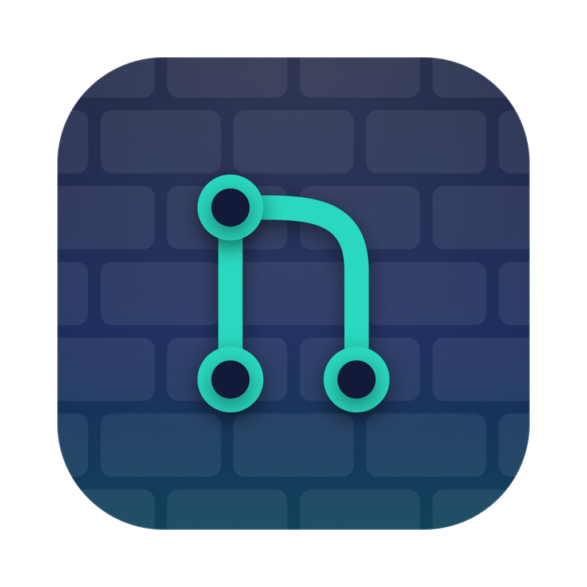

# Gitwall

Pull requests and issues on your desktop.

Gitwall is a free, open-source macOS menu bar app with desktop widgets. It gathers open pull requests (merge requests) and issues from the GitHub and GitLab repositories you choose and lists them by latest activity, with review, CI, draft and conflict status visible at a glance. Click an item to open it in your browser.

## Features

- GitHub and GitLab, cloud and self-hosted, in one list
- Named views such as "My PRs", "Waiting for my review" or "All open", with filters for type, relation to you, drafts, labels, review and CI state, age, milestone and text
- Desktop widgets in four sizes, each showing the view you pick
- Menu bar popover with an optional item count next to the icon
- Local notifications for new items, review requests, approvals, requested changes, CI failures, merges and closes
- A short walkthrough on first launch: account, repositories, views, notifications, widget
- Refresh interval from 1 to 30 minutes, manual refresh from the menu bar and the widget
- Sign in with GitHub or GitLab in one click, or paste a personal access token; you stay signed in
- No account with the developer, no analytics, no third-party services. Tokens stay in your Keychain.

## Requirements

- macOS 14 Sonoma or later
- A GitHub or GitLab account with access to the repositories you want to follow

## Get Gitwall

- Direct download: [Gitwall 0.2.0](https://github.com/prokopsimek/gitwall/releases/latest), signed with a Developer ID
  and notarized by Apple. Unzip and move Gitwall.app to Applications. It does not update itself.
- Mac App Store: in review; the store version will update automatically.

## Links

- [Source code](https://github.com/prokopsimek/gitwall) (MIT license)
- [Privacy policy](privacy.md)
- [Report an issue](https://github.com/prokopsimek/gitwall/issues)

## Widgets

1. Right-click the desktop and choose **Edit Widgets…** (or click the clock in the menu bar and scroll to
   **Edit Widgets**).
2. Search for **Git** and drag a widget to the desktop: **Counter** (small), **List** (medium),
   **Board** (large) or **Wide Board** (extra large).
3. Right-click the widget → **Edit “Gitwall”** → choose the preset it should show.

Add as many widgets as you like; each keeps its own preset and size. Presets (which accounts,
repositories, item kinds and filters) are managed in the app under Settings › Presets.
